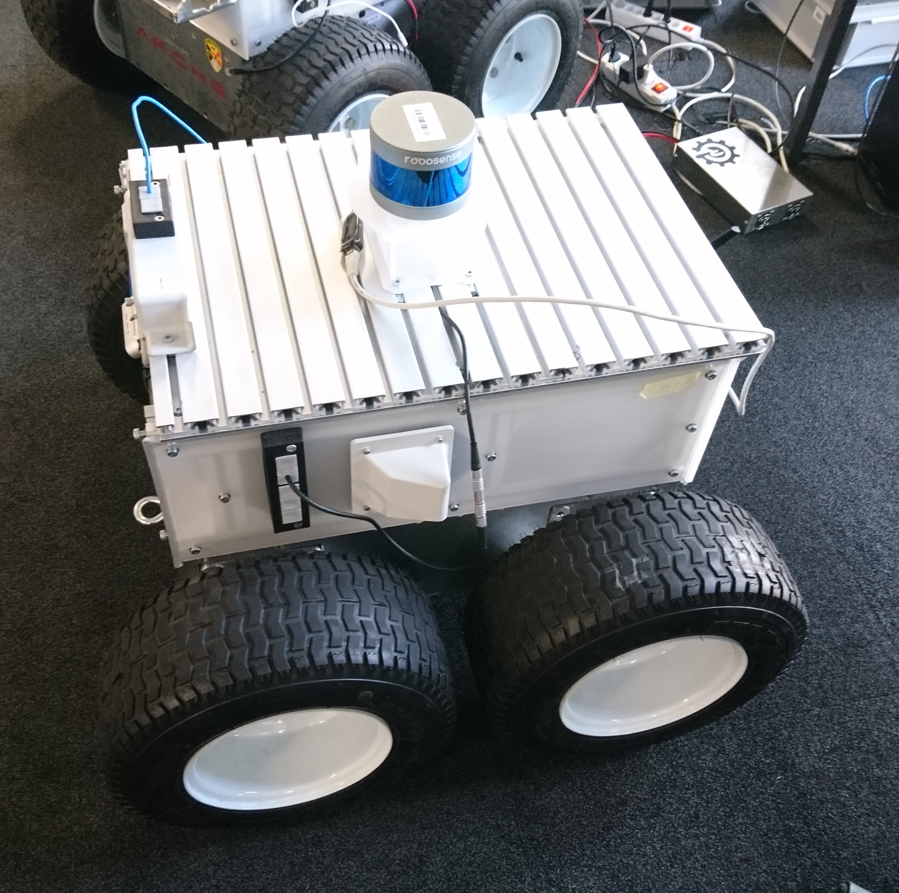
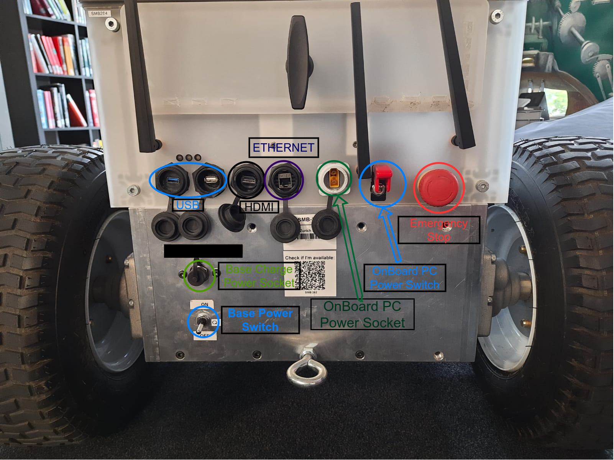
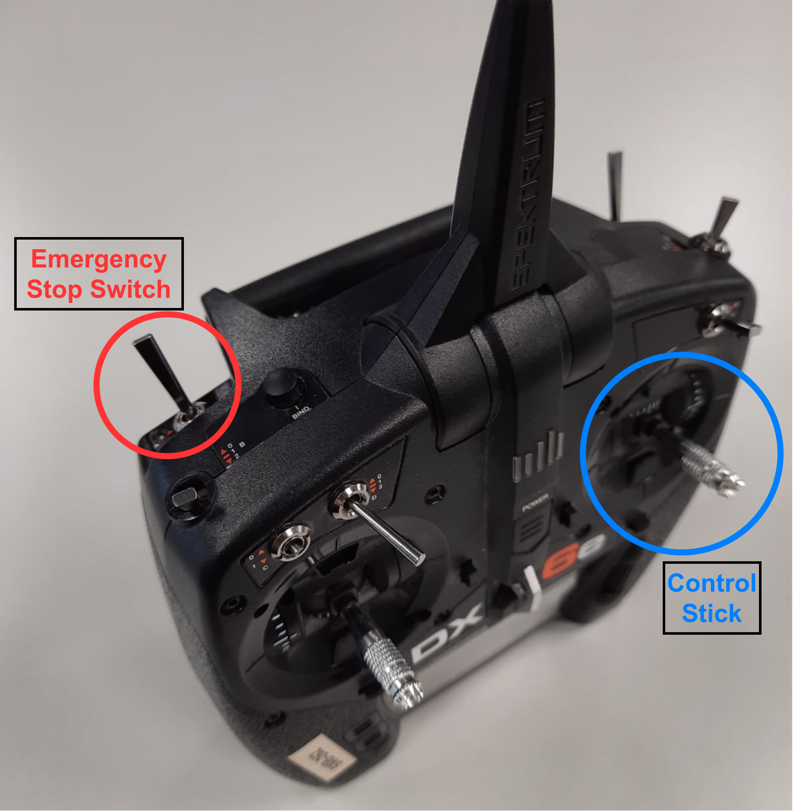

> This documentation explains the notions that are used in other documents. The documentation might lack of of some information since the updated SMB software is still work in progress!  
> Please inform oilter@ethz.ch for any missing or unclear instruction.

## SMB 

  

The four wheels of the SMB base are driven by individual motors, connected to a gear box to get sufficient torque. The two motors on each side are connected to the same channel of the motor controller respectively, which results in a classical skid steer configuration. 

SMB consist of two parts: Base and payload.

  

## RC Transmitter

  

## Emergency Stops

  

