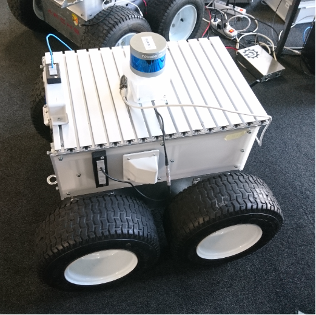
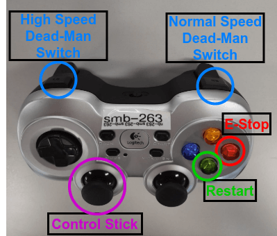

This documentation explains the notions that are used in other documents.
Please inform oilter@ethz.ch for any missing or unclear instruction.
{: .smb-mention }

## SMB 

  

The four wheels of the SMB base are driven by individual motors, connected to a gear box to get sufficient torque. The two motors on each side are connected to the same channel of the motor controller respectively, which results in a classical skid steer configuration. 

SMB consist of two parts: Base and payload.

  

Click [here](images/SMB_Backpanel.png) to see it bigger

## RC Transmitter

  

## JoyStick

  

## Emergency Stops

  

## Some Notions

### Git 
Git is software for tracking changes in any set of files, usually used for coordinating work among programmers collaboratively developing source code during software development. Its goals include speed, data integrity, and support for distributed, non-linear workflows (thousands of parallel branches running on different systems).

For more info please refer to this [link](https://medium.com/@itswisdomagain/git-101-introduction-to-git-for-newbies-bb14f6f9fc1)

### Ubuntu Terminal 
The Linux command line is a text interface to your computer. Often referred to as the shell, terminal, console, prompt or various other names, it can give the appearance of being complex and confusing to use.

For more info please refer to this [link](https://ubuntu.com/tutorials/command-line-for-beginners#1-overview)

* #### Export 
  A command in the Bash shell language. When used to set a variable, as in your example, the variable (PATH) will be visible ("exported to") any subprocesses started from that instance of Bash. Without the export command, the variable will not exist in the subprocess.
