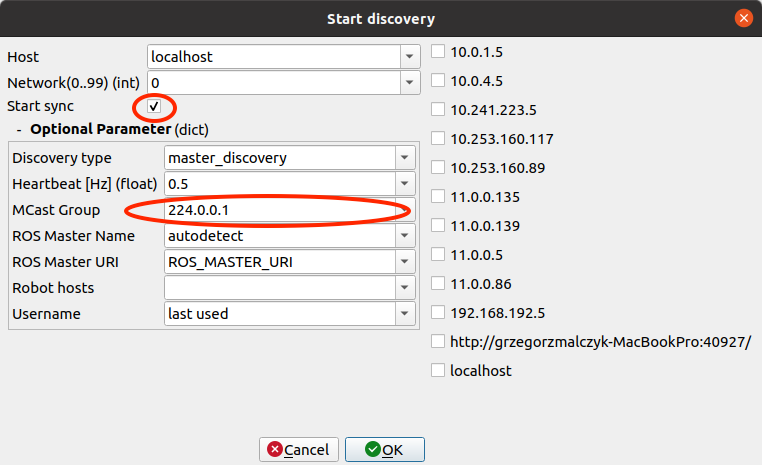
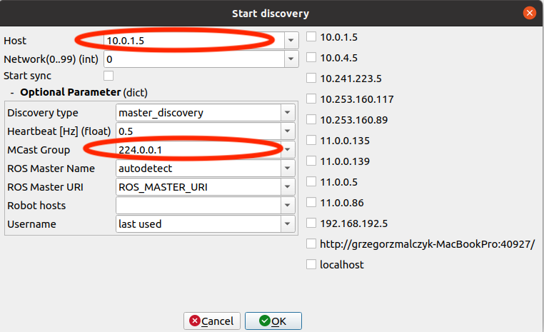
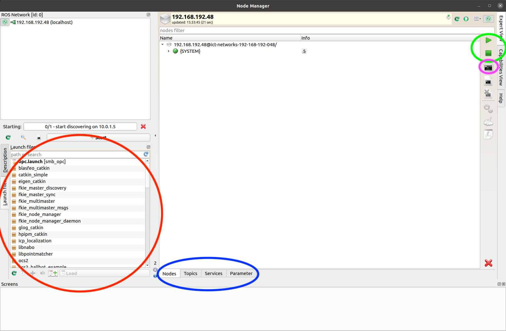

# How to use fkie_node_manager for the SMB?
This documentation explains the basic steps about how to run node manager for the SMB.
{: .smb-info }

## Preliminary steps
1. The detailed instructions how to install the Node Manager can be found in the [multimaster_fkie repository](https://github.com/ETHZ-RobotX/multimaster_fkie). Please clone the repository within your SMB workspace.
2. Connect your host machine to the corresponding SMB WiFi network.
3. In your local machine add the hostname of the SMB.
  - on ssh console window run: `hostname` and `hostname -I` to get the address and name of the SMB to which you are connected
  - on your host machine, run `sudo nano /etc/hosts` and add the address with SMB hostname obtained within the previous step as depicted on the image below
  - For the VPN connection:
    * on your local machine check your IP address which corresponds to the VPN by running `hostname -I`
    * add this IP address to the hosts file, i.e. your IP (separated by tab) and localhost.

  For reference your hosts file should look similar to the following:
      ```bash
      127.0.0.1       localhost
      127.0.1.1       grzegorzmalczyk-MacBookPro

      10.0.1.5        smb-261-nuc
      10.0.2.5        smb-262-nuc
      10.0.3.5        smb-263-nuc
      10.0.4.5        smb-264-nuc
      #10.241.54.11   localhost add --> uncomment this line when using VPN and add your IP address
      ```

## Establish a connection between host and SMB
1. On your local machine, in the console window, execute `hostname -I` to get an IP address. If multiple IP addresses are present, take the one corresponds to the actual chosen network connection.

2. In the same console window, run:
```bash
export ROS_IP=#IP address of your host machine
```
after sourcing your workspace execute:
```bash
node_manager
```
3. Click on the Start button, and the following window should appear:
<p align="center">
  
</p>
set the MCast Group to `224.0.0.1`, check Start sync box and without introducing any other changes press OK.
4. Again, click Start button, but now change the Host to the hostname of the SMB e.g. for SMB261 `10.0.4.1`, the MCast Group to `224.0.0.1`. The window should look as follows:
<p align="center">
  
</p>
Press OK. If you would be ask to provide user and password, use 'smb' for both.
The SMB ROS Network should appear in the upper left corner of the Node Manager window, just below the localhost network.

## Launch files
In the panel below the ROS Network, you can search for launch files that can be started either on SMB or on your host machine. By selecting the appropriate launch file, in order to load it press the Load button in the lower part of this panel. After successfully loading the launch file the associated node should appear in the main panel. Marked with red in the image below.

### Start ROS node
Select a ROS node, which needs to be run, and use the green play button on the left side to start the node. Marked with green in the image below.

### Kill ROS node
In order to kill the node, select it and press the green stop button which is below the previously mentioned play button. Marked with green in the image below.

### Console for a single ROS node
If the node has been successfully launched, you can inspect it via the console output by pressing the console symbol or by pressing F3. Marked with purple in the image below.


### Editing launch file
To inspect and edit the launch file corresponding to the node of interest, select the node and press F4.

<p align="center">
  
</p>

## Synchronization of both ROS masters
Node Manager synchronizes all the ROS topics and ROS services, but unfortunately not ROS parameters. To share the ROS parameters between both masters, go to the Parameter tab and load all parameters (symbol with small blue arrow). Then select which parameters need to be shared and export them to the second ROS Master by pressing the big blue arrow pointing to the right. Marked with blue in the image above.

# Troubleshooting
  - You get an exception on access the remote host: Exception: ssh connection to REMOTE_HOST failed: not a valid RSA private key file. Generate an SSH key file with e.g. `ssh-keygen -p -m PEM -f ~/.ssh/id_rsa`
  - Before starting the node manager make sure that no processes are running in the detached mode, i.e. execute `screen -ls`. You should get a similar output to the following one:
    ```bash
    76259._roscore--11311	(21.06.2021 17:22:32)	(Detached)
    ```

    To kill such a process execute `kill 76259`.
