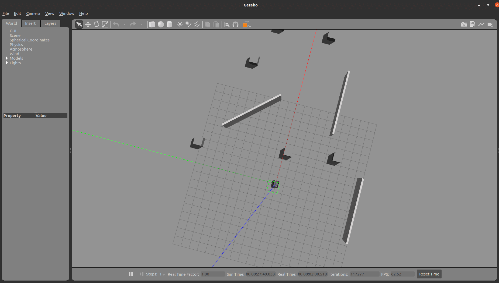
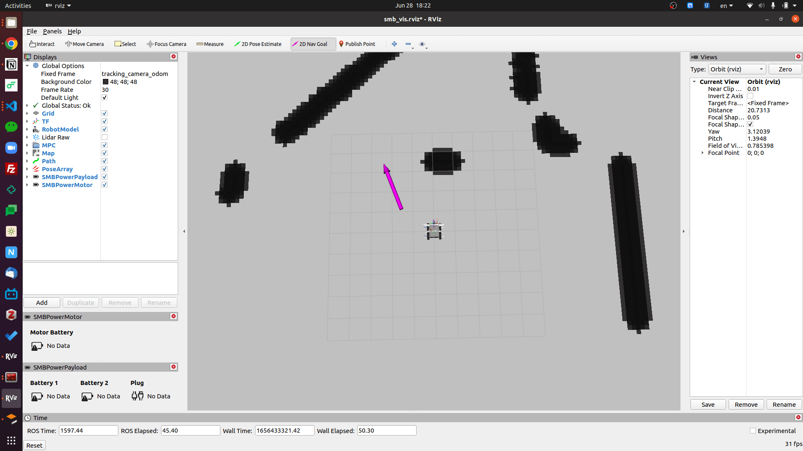

# How to Run SMB Software?
{:.no_toc}
This documentation explains the basic steps on how to run SMB software.

Please [create an issue](https://github.com/ETHZ-RobotX/SuperMegaBot/issues/new) for any missing library, package, driver, error or any kind of unclear instruction.
{: .smb-mention }

* Table of contents
{:toc}

## Remark
{:.no_toc}

This document does not explain the full capability of the robot. It gives basic information related to the core software and how to run it. For more information please check the packages.

In this document there are two terminal types:

1. Terminal on your PC: A terminal on your PC (called _host PC_).
2. Terminal of the SMB: A terminal on the SMB, established via a SSH connection.

If you're planning to use the software on the robot, please be sure that you followed the [How to drive the SMB documentation](../robot-operation/HowToDriveTheSMB.md).
{: .smb-info }

To connect to the SMB please refer to the [HowToConnectSMB Document](../robot-operation/HowToConnectToSMB.md).
{: .smb-info }

## Use of Basic Functionality

You can run the software either in simulation or on the real robot. In both cases, you can control the robot manually (e.g using a jostick/joypad) or operate it in autonomous mode.

In both modes all sensor values, odometry and robot state can be read and visualized. In autonomous mode, you can give a goal position for the robot to navigate autonomously via the Rviz interface.

### Simulation Mode

The simulation in `WaA.world` (stands for Test venue in Wangen an der Aare) runs on the host PC (your computer). To run the simulation you do not need a connection to SMB.

```bash
# In the host pc
roslaunch smb_gazebo sim.launch launch_gazebo_gui:=true world:=WaA
```

Now you have two possibilities to drive with the robot.

1. If you have a joystick connect it to the laptop. You can see the button configuration [here](../NotionsAndDevices.md#joystick).
2. You can also drive the robot with the keyboard. If you want to drive the robot, make sure that the terminal where you launched the simulation (i.e. where the `teleop_twist_keyboard` node is running) is selected while pressing the keys. Please refer to the [package documentation](http://wiki.ros.org/teleop_twist_keyboard#Controls) for the key bindings. To use the keyboard execute the following command:

    ```bash
    # In the host pc
    roslaunch smb_gazebo sim.launch launch_gazebo_gui:=true keyboard_teleop:=true
    ```

For more information about different simulation worlds, you could find details and test different worlds from [smb_common/smb_gazebo/worlds/](https://github.com/ETHZ-RobotX/smb_common/tree/master/smb_gazebo/worlds).
{: .smb-info }

### Autonomous Navigation in Simulation

More information about the path planner can be found in the [path planner repository](https://github.com/ETHZ-RobotX/smb_path_planner).

Since we have successfully set up the SMB software, one can launch the simulation and get the first experience with the OMPL path planner.
Make sure that the `smb_navigation` is built. If not, run:

```bash
# In the host pc
catkin build smb_path_planner
```

Then, launch the simulation environment in `planner_tutorial.world`:

```bash
# In the host pc
roslaunch smb_gazebo sim.launch launch_gazebo_gui:=true world:=planner_tutorial
```

Subsequently, in a second terminal window launch the OMPL path planner:

```bash
# In the host pc
roslaunch smb_navigation navigate2d_ompl.launch sim:=true global_frame:=tracking_camera_odom
```

In RVIZ, you should see a grey-scaled map with SMB in the middle. Now, select `2d Navigation Goal` from the top toolbar and set the goal for the planner in the feasible region within the map.

| Gazebo | RVIZ |
| ------------------ | ------------------ |
| <a href="../images/gazebo_viz.png" target="_blank"></a> | <a href="../images/rviz_viz.png" target="_blank"></a> |

> PS: click image to see in full size.

To be able to use the advanced features of the path planner, refer to the [SMB path planner Wiki](https://github.com/ETHZ-RobotX/smb_path_planner/wiki).
{: .smb-info }

### Running the core software on the robot

To launch the core software on the robot, run the following command.

```bash
# In the terminal of the SMB
roslaunch smb smb.launch

# If you see the message "First IMU Received",
# everything started without any problem
```

You can test the sensors by displaying the published topics.

```bash
# In a terminal of host PC

# Display the list of available topics
rostopic list

# Example: Display the measured wheelspeeds
rostopic echo /wheelSpeeds
```

To visualize the sensor readings via Rviz

```bash
# In the terminal of host PC
roslaunch smb_opc opc.launch

# You should see the robot model in Rviz
```

You might need to restart the _SMB base_ if the robot does not respond to sofware commands.
{: .smb-info }

Once the core software (`smb.launch`) is started on the robot, you have several options:

1. Control the robot using the RC transmitter. The signals from the RC transmitter are read out by the onboard computer and sent to the motor controller.
2. Use a Joystick to generate control signals (twist messages) In order to control the SMB with the joystick, you should keep presing the L1 button while driving and use the left stick to control the robot.
3. Run the autonmous software stack as outlined in the following section.

### Running the autonomous navigation software

To run the navigation software, you first need to start the core software on the robot (if not already done so).
{: .smb-info }

```bash
# In the terminal of SSH
roslaunch smb smb.launch

# If you see the message "First IMU Received",
# everything started without any problem
```

To start the autonomous navigation please run the following terminal command in an other terminal window.

```bash
# In the terminal of SSH
roslaunch smb_navigation navigate2d_ompl.launch

# If you see the message "odom received",
# everything started without any problem
```

To visualize the sensor reading via Rviz

```bash
# In the terminal of host PC
roslaunch smb_opc opc.launch

# You should see the robot model in Rviz
```

After that you can use the Rviz 2D Navigation Goal tool.
