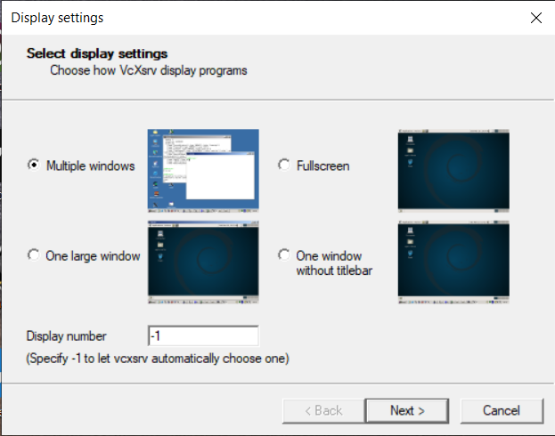
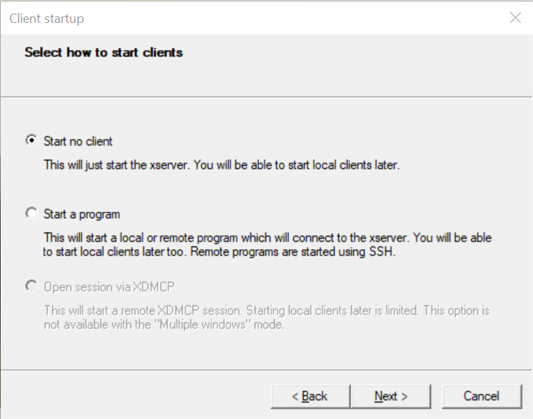
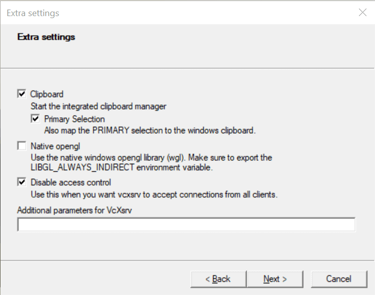

# Using Docker for Simulation
{:.no_toc} 

Documentation of the SuperMegaBot (SMB) Docker for the ETHZ Robotic Summer School.

To use the SMB Docker, basic knowledge of Docker is needed. Please check [the official website](https://docs.docker.com) to learn how to build, save, reconnect etc.
{: .smb-mention}


* Table of contents
{:toc}

## Setting up Docker

### Linux
1. Install Docker by following [the official website](https://docs.docker.com/engine/install/)
2. Clone the [repo](https://github.com/ETHZ-RobotX/smb_docker/) into a directory on your host computer
3. Run the bash file to create the container

```bash
# Go the directory where you downloaded the repo to
cd <path/to/repo>

# Activate Container
./create_container.bash
```

This will automatically setup your system to later run the docker and download the pre-compiled image from dockerhub. Once downloaded, the script starts a container called `smb_container` that can be used to run the SMB software (see [reconnecting to the docker container](#reconnecting-to-the-docker-container)).


### Windows

1. Install Docker Desktop by using [the official website](https://docs.docker.com/desktop/windows/install/)
2. Install VcXsrv [here](https://sourceforge.net/projects/vcxsrv/)
3. Launch VcXsrv and put the settings as in the pictures
   {: width="600px"}

   {: width="600px"}

   {: width="600px"}

4. Open the powershell and run

```bash
# Run docker
docker run -it --env="DISPLAY=host.docker.internal:0.0" --volume=smb_volume:/home/catkin_ws/src --net=host --name smb_container ethzrobotx/smb_docker bash
```

5. To exit the container type `exit` in the terminal

## Setup Visual Studio Code for use with Docker container

Visual Studio Code is a powerful integrated development environment that even allows accessing code inside a Docker container.
Usage of Visual Studio is not necessary.
{: .smb-info}

1. Open Visual Studio Code and install the **dev - containers** extension.
2. Click on the extension on the bottom left corner and attach to the previously created container.
3. When the new window opens install the **C/C++** and **Python** extension from Microsoft inside the container. This is needed in order to get autocompletion.
4. The catkin workspace is located in /home/catkin_ws

## (Re-)connecting to the Docker container

Once you have setup the smb_container, you can create a terminal (bash shell) by running

```bash
docker exec -it smb_container bash
```

There is no need to run the script create_container.sh anymore. 

If you closed all running instances of bash in the `smb_container`, you might need to start it again by running

```bash
# start docker container
docker start smb_container

# create a terminal (bash) in the container:
docker exec -it smb_container bash
```

The latter command can be repeated multiple times to create several terminals in the same container.

## How to use the simulation in the Docker container

If you want to run the simulation you can follow the [how to run SMB software](HowToRunSoftware.md) and run the commands given there in a terminal in the smb_container. I.e.

```bash
# create a terminal (bash) in the container:
docker exec -it smb_container bash
```

In the then so created terminal, run:

```bash
roslaunch smb_gazebo sim.launch
```

## Known issues
### /tmp/.docker.xauth
It might happen that after rebooting your system you will get the following error:
```bash
Error response from daemon: failed to create shim task: OCI runtime create failed: runc create failed: unable to start container process: error during container init: error mounting "/tmp/.docker.xauth" to rootfs at "/tmp/.docker.xauth": mount /tmp/.docker.xauth:/tmp/.docker.xauth (via /proc/self/fd/7), flags: 0x5000: not a directory: unknown: Are you trying to mount a directory onto a file (or vice-versa)? Check if the specified host path exists and is the expected type
Error: failed to start containers: smb_container
```
In that case, try to run the script [`restart_container.sh` from the smb_docker repository](https://github.com/ETHZ-RobotX/smb_docker/blob/master/restart_container.bash). 
