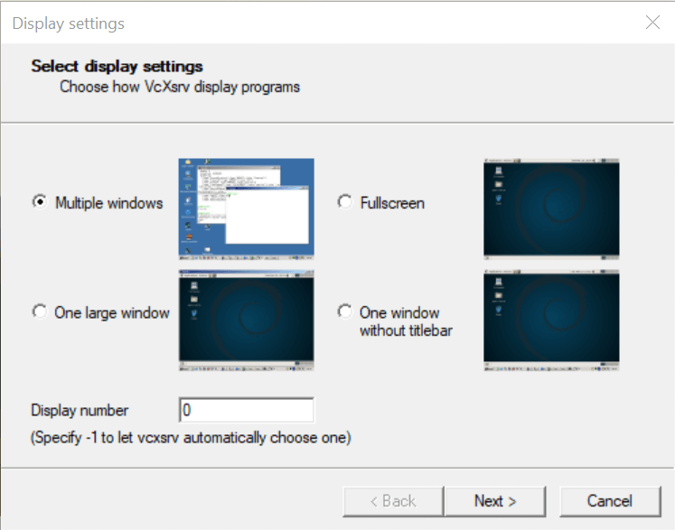

# Using Docker for Simulation
{:.no_toc} 

Documentation of the SuperMegaBot (SMB) Docker for the ETHZ Robotic Summer School.

To use the SMB Docker, basic knowledge of Docker is needed. Please check [the official website](https://docs.docker.com) to learn how to build, save, reconnect etc.
{: .smb-mention}


* Table of contents
{:toc}

## Setting up Docker

### Linux
1. Install Docker by following [the official website](https://docs.docker.com/engine/install/)
2. Clone the [repo](https://github.com/ETHZ-RobotX/smb_docker/) into a directory on your host computer
3. Run the bash file to create the container

```bash
# Go the directory where you downloaded the repo to
cd <path/to/repo>

# Activate Container
create_container.bash
```

4. To exit the container type `exit` in the terminal


### Windows

1. Install Docker Desktop by using [the official website](https://docs.docker.com/desktop/windows/install/)
2. Install VcXsrv [here](https://sourceforge.net/projects/vcxsrv/)
3. Launch VcXsrv and put the settings as in the pictures
   
   
   
4. Open the powershell and run

```bash
# Get your ip address
ipconfig

# Run docker
docker run -it --env="DISPLAY=<YOUR_IP_ADDR>:0.0" --volume=smb_volume:/home/catkin_ws/src --net=host --name smb_container ethzrobotx/smb_docker bash
```

5. To exit the container type `exit` in the terminal

## Setup Visual Studio Code for use with Docker container

Visual Studio Code is a powerful integrated development environment that even allows accessing code inside a Docker container.
Usage of Visual Studio is not necessary.
{: .smb-info}

1. Open Visual Studio Code and install the **Remote - Containers** extension.
2. Click on the extension on the sidebar and connect to the previously created container.
3. When the new window opens install the **C/C++** and **Python** extension from Microsoft inside the container. This is needed in order to get autocompletion.

## Reconnecting to the Docker container

```bash
# Start the Docker Container
sudo docker container start smb_container

# Attach the Docker Container
sudo docker container attach smb_container
```

## How to use simulation the Docker

If you want to launch several sessions connected to the same container from multiple terminals: 

```bash
# Launch new session to the same container
docker exec -it smb_container bash
```

If you want to run the simulation you can follow the [how to run SMB software](https://ethz-robotx.github.io/SuperMegaBot/core-software/HowToRunSoftware.html).

You can run launch_gazebo_gui:=false if you do not need to see the simulation environment. Yet, you can recognize the obstacles in the Rviz visualization tool thanks to the modeled sensor behavior.
{: .smb-info}