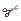
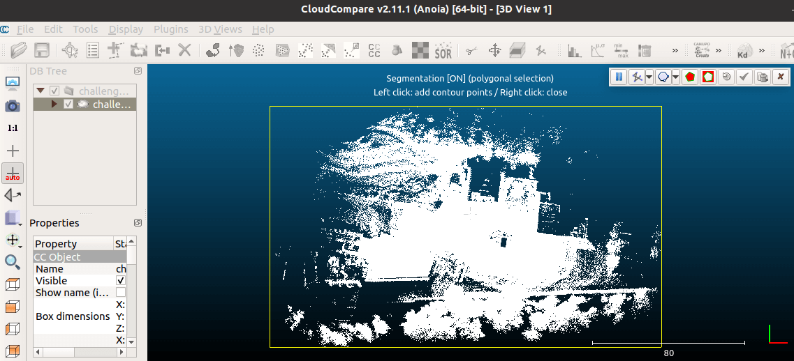
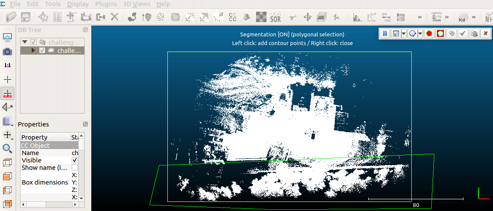
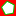
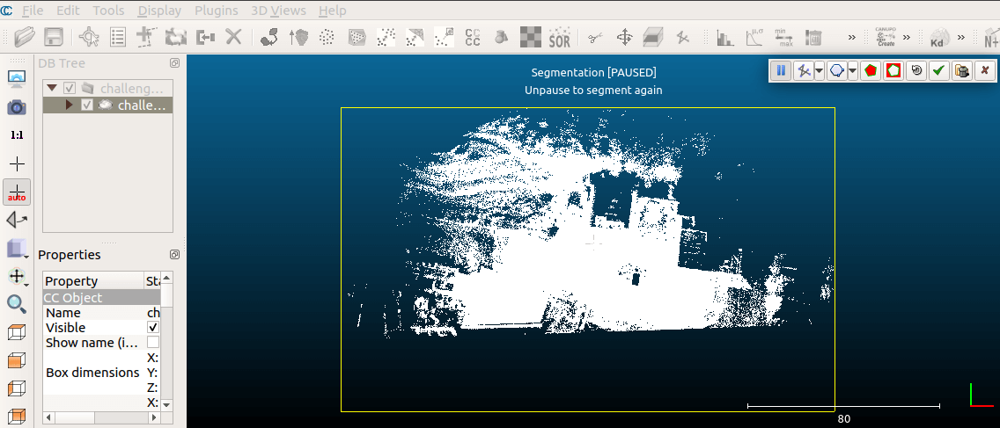
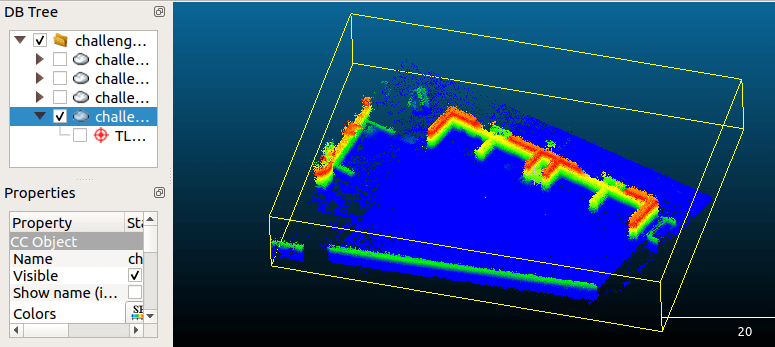
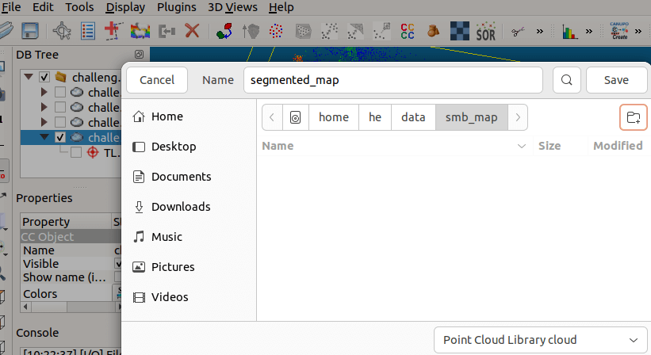

# 📋 Frequently Asked Questions
{:.no_toc}

This page covers the most frequently asked questions that arise when using the SMB simulation and working on the real robot.

For recent and past queries, please refer to the [GitHub Issues](https://github.com/ETHZ-RobotX/SuperMegaBot/issues) of this repository.

* Table of contents
{:toc}

## 📂 How can I transfer a file to a USB3 drive (Ubuntu)?

> From [How to access a usb flash drive from the terminal? - askubuntu](https://askubuntu.com/questions/37767/how-to-access-a-usb-flash-drive-from-the-terminal)

### 🔍 Figure out the name of the USB stick

Most likely, the device name of the USB stick is `sda1`, but it could be different. To find the name of the USB drive, execute:

```bash
lsblk
```

### 🗂️ Create a mounting point
Create the folder where the USB will be mounted (essentially a folder linked to the USB). Create the following folder if it does not already exist:

```bash
sudo mkdir /media/usb
```

### 🔗 Mount the USB
Mount the USB drive using the following command:

```bash
sudo mount /dev/sda1 /media/usb
```
### ⚠️ Unmount!
Remember to unmount the USB stick before disconnecting it; otherwise, you may corrupt it!

```bash
sudo umount /media/usb
```
## 🗺️ How to prepare a processed pointcloud for localization and 2D grid map creation?
> modified from [Interactive Segmentation Tool - CloudCompareWiki](https://www.cloudcompare.org/doc/wiki/index.php/Interactive_Segmentation_Tool)

### 💾 Download the CloudCompare software
You can find the suitable version [here](https://www.cloudcompare.org/release/index.html) for your OS.

### ✂️ Segment pointcloud with the tool
1. Load the built pointcloud (.pcd format) in CloudCompare via the **`File -> Open` menu** or **dragging the pointcloud**.

2. Select a suitable viewpoint and launch the tool via the  **icon in the main upper toolbar** or the **`Edit > Segment` menu**.

    
3. Use left click to add a contour to contain a region of interest (polygon or rectangle) and right click to close the region.

    

4. Once the polygon/rectangle edition is finished, choose whether to keep points inside () or outside () the polygon. The other points will disappear (as well as the polygon) after clicking the check sign.

    
5. Segment until the clean pointcloud is achieved and select the segmented one to save as **`.pcd` format (Point Cloud Library cloud)**.

    {: .note }
    You could achieve better colorized visualization by using the **`Edit > Colors > Height Ramp` menu**.

    
    <br>
    <small>Colorized visualization of segmented pointcloud</small>

    
    <br>
    <small>Export segmented pointcloud as `.pcd` format (Point Cloud Library cloud)</small>
