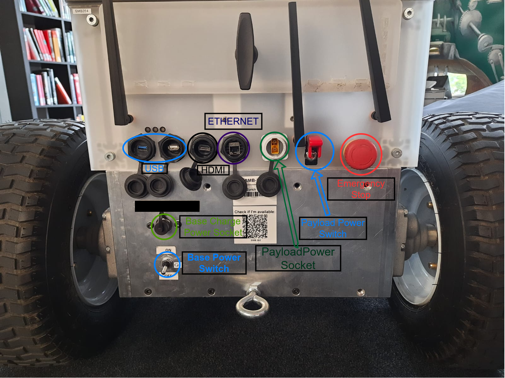
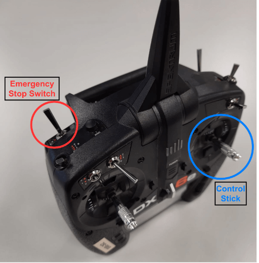

# 🔧 SMB Hardware Info
{: .no_toc}

  

The four wheels of the SMB base are driven by individual motors, connected to a gearbox to get sufficient torque. The two motors on each side are connected to the same channel of the motor controller respectively, which results in a classical skid steer configuration. 

The SMB consists of two parts: Base and payload.

* Table of contents
{:toc}

## 🚜 Base

TODO: talk about the drive system and components of the base

## 📦 Payload

TODO: talk about the sensors and components in the payload

The payload for the SuperMegaBot incorporates sensors, an onboard computer, networking utilities, and a power system. It was developed with the goal to allow quick adaptations for various applications. 

With its grooved top plate, an extra sensor or even a manipulator can easily be attached to the payload.

The whole payload can be powered using batteries or via an external power supply. The custom-designed power system allows switching power sources without turning off the system (and thus allows hot-swapping of batteries).

## 🔌 Ports

  

Click [here](../images/SMB_Backpanel.png) to see it bigger.

SMB has ports for connections and charging.

The base has 2 USB-A ports (1xUSB3.0 and 1xUSB2.0), an HDMI port, and an Ethernet port connected to the NUC inside. Also, there's a socket to charge the base. The red one is the emergency stop physical button which has the highest priority over other emergency stop options. This shuts down the power for the motors. Furthermore, the payload switch turns on/off the power for the internal NUC and sensors, and Jetson Xavier inside.

The payload has the base charger power socket to charge the battery for the base, and a base power switch to turn on/off the base.

## 📡 RC Transmitter

  

The RC Transmitter can be used to control the robot once the safety stop is not active. The control commands sent by the remote always have the highest priority, even if the SMB is in autonomous mode. The remote also contains an emergency stop switch as depicted on the top left in the above image.

## 🛑 Emergency Stops

Emergency stops are crucial for ensuring the safety of both operators and the robot. The SuperMegaBot has two ways to cut power to the motors and, if connected, external payloads:

1. An emergency stop button on the payload itself
2. Handheld wireless emergency stop system

### Handheld Wireless Emergency Stop System

  

The wireless emergency stop system is manufactured by HBC radiomatic and operates in the 434 MHz frequency band. It consists of a receiver, HBC FSE 510, and the transmitter, the HBC orbit. While the receiver is powered by the base of the SMB (no need to turn on the payload to drive the SMB manually), the transmitter is battery-powered. The batteries are NiMH based and can be charged in the corresponding charger.

It is strongly advised to keep one person in charge who is actively monitoring the status of the robot, and quickly press the safety button (as depicted in the above image) to stop the motors in case of unintended behaviour occurance.
{: .warning }

## 🎮 Joystick
Deprecated
{: .label .label-red }

  

The joystick can also be used to control the robot. Click [here](../images/JoyStick.png) to enlarge.
