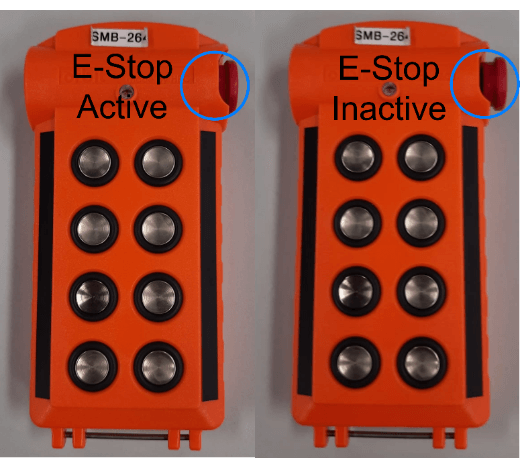

# How to drive the SMB? 
{: .no_toc}

This documentation explains the basic steps about how to safely drive the SMB robot.

* Table of contents
{:toc}


## Emergency Stop
For safety purposes, the power input to the motor controller can be cut off by de-energizing a contactor that is part of the [SMB emergency stop system](https://unlimited.ethz.ch/display/ROBOTX/SMB+Emergency+Stop+System).\
Emergency buttons are in series so if one of them is pushed e-stop is activated! This means, the motor controller and thus motors are not powered anymore, robot stops! 
<p align="center">
  
</p>


## RC Connection and Transmitter
When driving the SMB base using the RC transmitter, there is an additional switch on the RC Transmitter to stop all motor movement. It is located on the lower back left of the RC Transmitter with the name [Emergency Stop Switch](../images/RCTransmitter.png) and can be used to activate the safety stop functionality of the motor controller powering the motors. The safety stop is activated in the lower position (0).\
Note that when the software overrides the RC commands. 


## Powering Up 

In the SMBs there is an emergency stop system directly connected to the base. Therefore, a wireless e-stop switch is needed to activate the motors. When the [e-stop switch is activated](../images/E-Stop.png), motors do not receive any power.\
Keep the wireless e-stop transmitter close by (e.g. attach it to your belt or similar), in order to be able to switch off all power to the motors in case of an unlikely failure of the motor controller resulting in the robot being uncontrollable. Note that the emergency stop is not a brake system so the robot might continue to move due to its inertia.


Please follow the steps carefully.

1. Before doing anything else, be sure that emergency stop buttons are in the activated position so that the motors cannot be powered up.
   * [The Emergency stop button](../images/SMB_Backpanel.png) on the back panel is activated.
   * The E-Stop switch is in activated [e-stop switch is activated](../images/E-Stop.png).
  
2. Turn on the RC transmitter.
   * Be sure that the transmitter is connected to the right smb: check the number on the screen of the transmitter and the number that is written back panel of the smb 
   * Be sure that the [Emergency Stop Switch of the RC Transmitter](../images/RCTransmitter.png)  is in the position of 0. It gives '0' commands to the motots . 
   * BUT IF THERE IS A PROBLEM WITH THE CONTROLLER (e.g. the robot is uncontrollable) USE THE EMERGENCY STOP SWITCH! THAT SAFETY STOP SWITCH MIGHT NOT WORK 

3. Power up the base using the switch [Base Power Switch](../images/SMB_Backpanel.png). This switch activates also the wireless e-stop receiver.
   * Since the wireless e-stop system is energized and it is in the activate state (we did so in step 1), we can deactivate the [Emergency Stop Button on the SMB](../images/SMB_Backpanel.png). 
  
4. Deactivate the wireless e-stop by pulling out the button.
    * As soon as the emergency stop circuit is closed, you should hear a mechanical clicking sound. This clicking sound originates from the contactor that physically closed the power circuit to the motors. Also, the LED on the wireless e-stop transmitter should be blinking at a regular interval. 
    * Now you are able to drive drive the SMB using the RC transmitter
  
5. Be sure that the safety stop switch on the RC transmitter is functional by doing a small test.
    * Try to drive the robot while it is in the position 0 -> no movement 
    * Flipping the safety stop switch on the RC remote to position 1 should allow movement of the robot. Use the right control stick on the RC transmitter to steer the SMB. 
    * Switching the safety stop on the Remote back into position 0 should stop the robot. Try again to to control the robot while switch is in position 0. It should not move. 
6. Bring the safety stop switch to the position 1 again. Small movements on the stick are already enough to command forward motion. 


You can refer to the [How to Connect to the SMB document](HowToConnectToSMB.md) to learn about how to connect to SMB by using your pc. 
{: .smb-info }

## ShutDown Procedure
SMBs run with ubuntu 20.04, so the general shutdown procedure for an ubuntu computer applies here. For general remarks please see the followings:

Make sure that SMB does not have defined goal position to move to.
{: .smb-warning }

Make sure that SMB has no movement in its motors.
{: .smb-warning }

To shut down the on-board pc 
```bash
# In terminal of SSH to SMB
sudo poweroff
```

