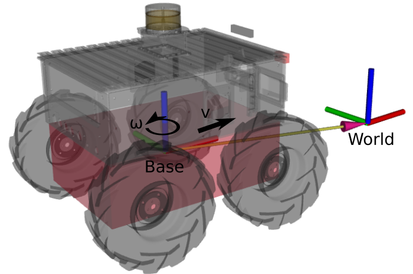

# Model Predictive Control Tutorial

## Goal
We want to steer the robot to an arbitrary goal pose. Since the SMB robots are non-holonomic and the base motion model is non-linear, simple control approaches like PID controllers for each component of the base state cannot be employed. Instead, we want to use Model Predictive Control (MPC) to plan motion for the robot.

In MPC, we use a model to simulate the future state evolution of a dynamic system. The model is a differential equation you will need to implement in the [first task](#1-system-modeling).

Cost functions govern the reference tracking behavior of the MPC. We will implement a cost function in the [second task](#2-cost-function) that steers the robot to a fixed point.

Finally, we want to control the robot to track a desired reference path. In the [third task](#3-reference-tracking), we create an interpolation module for incoming reference trajectories and use it in our cost function.

## 0.0 Recap - Differential Dynamic Programming

We are going to use the SLQ algorithm to solve the N-MPC problem.

### Basic steps algorithm:
1. Take the current control policy $[\boldsymbol{K}, \boldsymbol{u^*}]$ to compute control inputs:

    $$\boldsymbol{u}= \boldsymbol{K}(t) \cdot \boldsymbol{x}(t) + \boldsymbol{u^*}(t)$$

2. Forward integrate the current state $\boldsymbol{x}_0$ with the current policy to get state and input trajectories over the time horizon.
3. Compute second-order approximation of the cost functions around state and input trajectories.
4. Solve the Riccati Equation to get a new affine control policy.
5. Use a line search to find the best interpolation between the current and the new policy.

M. Neunert et al., “Fast nonlinear Model Predictive Control for unified trajectory optimization and tracking,” in 2016 IEEE International Conference on Robotics and Automation (ICRA), May 2016, pp. 1398–1404. doi: 10.1109/ICRA.2016.7487274.

## 0.1 Automatic Differentiation

Our MPC framework uses [automatic differentiation](https://en.wikipedia.org/wiki/Automatic_differentiation) to compute derivatives of system flow maps and cost functions.
We use CppAD Codgen as the implementation. It tracks the computational trees of our functions, generates C-code for the function and their derivatives, compiles, and then links against the libraries at runtime.
### Implications:
- You cannot use `std::cout` within the auto-generation methods
- All computations must be done with the `ad_scalar_t` type instead of `double`.
  `double` can be converted to `ad_scalar_t` implicitly.
  For “Eigen” matrices and vectors, you need to use the `.cast<ad_scalar_t>()` method to convert explicitly.

## 1. System Modeling

We are going to use a kinematic motion model for our mobile robot. The skid-steer base has non-holonomic constraints, i.e., it cannot move sideways. We parametrize the robot's state with a 3D vector for the position and a quaternion for the base orientation. In contrast to a simpler 2D model, our formulation allows for more accurate predictions when moving in sloped terrain.
Your task is to derive and implement the kinematic system model.
Derive flow map (the differential equation) $\boldsymbol{\dot{\boldsymbol{x}}} = f(\boldsymbol{x},\boldsymbol{u},t)$ for mobile robot.

Implement the system model in `SmbSystemDynamics::systemFlowMap` in file `smb_common/smb_mpc/src/SmbSystemDynamics.cpp`.
You can check whether your code compiles, but to see whether the implementation is correct, we first need to implement a cost function.

#### Given:

State $\boldsymbol{x}$:
- $(x,y,z)$ position in world frame
- $(q_x, q_y, q_z, q_w)$ quaternion rotation base to world frame

Time $t$

Control input $\boldsymbol{u}$:
- $v_x$: linear velocity in base frame (motion relative to world frame)
- $\omega_z$ : angular velocity in base frame (motion relative to world frame)

#### Wanted:
$\frac{\delta}{\delta t}(x,y,z, q_x, q_y, q_z, q_w)^T$

#### Hints:
The quaternion vector product $\boldsymbol{t}_W = \boldsymbol{q} \cdot \boldsymbol{t}_B$ transforms a vector from base to world frame. The `Eigen` library implements this product when multiplying an `Eigen::Quaterniond` type with a `Eigen::Vector3d` type.

You need to compute the time derivative of a quaternion of this task.
Start with the explicit equation for rotating the quaternion $boldsymbol{q_0}$ for a constant time $t$ with the rate $\omega$ around the axis $\boldsymbol{n}$. We use the Euler identity to retrieve the exponential representation of a unit quaternion:

$$
\begin{align}
\boldsymbol{q}(t) &= \boldsymbol{q_0} \boldsymbol{q_\omega^t} \\
\boldsymbol{q_\omega^t} &= cos(\omega t / 2) + sin(\omega t / 2)(n_x i+ n_y j+ n_z k) = exp(\omega t / 2 \cdot \boldsymbol{n})
\end{align}
$$

$\boldsymbol{n} = n_x i+ n_y j+ n_z k$ is a purely imaginary quaternion.

Remember that the quaternion multiplication does not commute ($\boldsymbol{q}_1\boldsymbol{q}_2 \neq \boldsymbol{q}_2\boldsymbol{q}_1$) but the scalar quaternion multiplication does commute.

Use the chain rule!
## 2. Cost function

Implement a cost function that penalizes deviations from the point $(x,y,\theta)$= $(2m, 5m, 90deg)$.

Method: `SmbCost::costVectorFunction` in file `smb_common/smb_mpc/src/cost/SmbCost.cpp`.

Test your changes in simulation. Execute `roslaunch smb_gazebo sim.launch mpc:=True` to run the simulation with the MPC. For implementation reasons, the robot will only start to drive once you send a goal with the rviz goal pose marker. It should, however, not go to the specified destination but to the hard-coded goal $(x,y,\theta)$= $(2m, 5m, 90deg)$.

#### Hints:
`SmbCost::costVectorFunction` returns a vector $result$.
The scalar value of the cost function is $result^T \cdot result$.

The easiest way to generate a quaternion of a specific rotation with the `Eigen` library is to pass an `Eigen::AngleAxis<SCALAR>` object to the constructor of the quaternion. 

One possible error function for rotational errors is to minimize the imaginary part of the relative rotation quaternion.

Do not forget to penalize control actions, too. Without costs on the input $\boldsymbol{u}$, the MPC framework cannot solve the Riccati Equation.

You can ignore the weight matrices `QPosition`, `QPosition`, `R` for now.

## 3. Reference Tracking

We want to track arbitrary trajectories with the robot.
When selecting a goal in rviz with the 2D Nav Goal marker, `SmbCost::getParameters` receives a trajectory of poses and timestamps.
The method should return a target pose for the time $t$.

Hint: `SmbCost::getParameters` works on double types. No `ad_scalar_t` type needed here.

The method `SmbCost::costVectorFunction` receives this target pose at the current time $t$. Modify the cost function to track this trajectory.

#### Hints:

A simple solution uses the last pose of an incoming path as the reference pose. Are more sophisticated solution interpolates the poses of an incoming trajectory.

Two quaternions can be interpolated with the `slerp` algorithm: $\boldsymbol{q}_\alpha = \boldsymbol{q}_1.slerp(\alpha, \boldsymbol{q}_2)$ with $\alpha \ in [0, 1]$.

## 4. Gains

The weight matrices: `QPosition`, `QPosition`, `R` are available in the cost function and are loaded from the configuration file:
`smb_common/smb_mpc/config/task.info`

Add the weights to the cost computation and find a good set of gains for the robot to track the reference path.

<!---
## 5. Dynamic System model (optional)

The kinematic system model assumes that the robot velocity can be changed instantaneously. Since this is not possible on physical systems there are going to be tracking errors.

A system model that takes accelerations as inputs and has the base velocity as part of the system state is more realistic since it does not allow for jumps in the velocity profiles.

Checkout the branch `mpc_tutorial/dynamic_model`

Implement a dynamic system model and a costfunction for tracking trajectories.
`smb_common/smb_mpc/src/SmbSystemDynamics.cpp`
`smb_common/smb_mpc/src/cost/SmbCost.cpp`
--->
