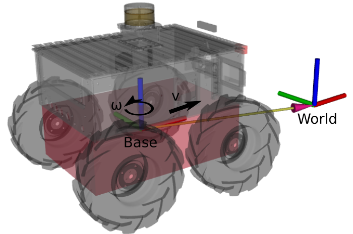

# Model Predictive Control Tutorial

## Goal
We want to steer the robot to an arbitrary goal pose. Since the SMB robots are non-holonomic and the base motion model is non-linear, simple control approaches like PID controllers for each component of the base state cannot be employed. Instead, we want to use Non-Linear Model Predictive Control to plan motion for the robot. 

## 0.0 Recap - Differential Dynamic Programming

We are going to use the SLQ algorithm to solve the N-MPC problem.

### Basic steps algorithm:
1. Take the current control policy $[\boldsymbol{K}, \boldsymbol{u^*}]$ to compute control inputs:

$$\boldsymbol{u}= \boldsymbol{K}(t) \cdot \boldsymbol{x}(t) + \boldsymbol{u^*}(t)$$

4. Forward integrate current state $\boldsymbol{x}_0$ with the current policy to get state and input trajectories over time horizon.
5. Compute second order approximation of the cost functions arround state and input trajectories.
6. Solve the Riccati Equation to get a new affine control policy.
7. Use a line search to find the best interpolation between the current and the new policy.

M. Neunert et al., “Fast nonlinear Model Predictive Control for unified trajectory optimization and tracking,” in 2016 IEEE International Conference on Robotics and Automation (ICRA), May 2016, pp. 1398–1404. doi: 10.1109/ICRA.2016.7487274.

## 0.1 Automatic Differentiation

In our MPC framework, we often use [automatic differentiation](https://en.wikipedia.org/wiki/Automatic_differentiation) to compute derivatives of system flow maps and cost functions.
We use CppAD Codgen as the implementation. It tracks the computational trees of our functions, generates C-code for the function and their derivatives, compiles and then links against the libraries at runtime.
### Implications:
- You cannot use `std::cout` within the auto generation methods
- All computations need to be done with the `ad_scalar_t` type instead of `double`.
  `double` can be converted to `ad_scalar_t` implicitly.
  For “Eigen” matrices and vectors, you need to use the `.cast<ad_scalar_t>()` method to convert explicitly.

## 1. System Modeling

Derive flow map $\boldsymbol{\dot{x}} = f(\boldsymbol{x},\boldsymbol{u},t)$ for mobile robot:

#### Given:

State $\boldsymbol{x}$:
- $(x,y,z)$ position in world frame
- $(q_x, q_y, q_z, q_w)$ quaternion rotation base to world frame

Time $t$

Control input $\boldsymbol{u}$:
- $v_x$: linear velocity in base frame (motion relative to world frame)
- $\omega_z$ : angular velocity in base frame (motion relative to world frame)

#### Wanted:
$\frac{\delta}{\delta t}(x,y,z, q_x, q_y, q_z, q_w)^T$

#### Hints:
$$
\begin{align}
\boldsymbol{q}(t) &= \boldsymbol{q_\omega^t} \boxdot \boldsymbol{q_0} \\
\boldsymbol{q_\omega^t} &= cos(\omega t / 2) + sin(\omega t / 2)(n_x i+ n_y j+ n_z k) = exp(\omega t / 2 \cdot \boldsymbol{n})
\end{align}
$$

Implement the system model in `SmbSystemDynamics::systemFlowMap` in file `smb_common/smb_mpc/src/SmbSystemDynamics.cpp`.
You can check whether your code compile but in order to see whether the implementation is correct, we first need to implement a costfunction.

## 2. Cost function

Implement a cost function that penalizes deviations from the point $(x,y,\theta)$: $(2m, 5m, 90deg)$

Method: `SmbCost::costVectorFunction` in file `smb_common/smb_mpc/src/cost/SmbCost.cpp`.

Test your changes in simulation. Execute `roslaunch smb_gazebo sim.launch mpc:=True` to run the simulation with the MPC.

#### Hint:
`SmbCost::costVectorFunction` should return a 3-dim vector (`result`) with three elements.
The scalar value of the cost function is $result^T \cdot result$.

## 3. Reference Tracking

We want to track arbitrary trajectories with the robot.
When selecting a goal in  rviz with the 2D Nav Goal marker, `SmbCost::getParameters` receives a trajectory of poses and timestamps.
The method should return a target pose for the time $t$.

Hint: `SmbCost::getParameters` works on double types. No `ad_scalar_t` type needed here.

The method `SmbCost::costVectorFunction` receives this target pose at the current time $t$. Modify the cost function to track this trajectory.

## 4. Gains

The weight matrices: `QPosition_`, `QPosition_`, `R_` are available in the cost function and are loaded from the configuration file:
`smb_common/smb_mpc/config/task.info`

Find a good set of gains for the robot to track the reference path

<!---
## 5. Dynamic System model (optional)

The kinematic system model assumes that the robot velocity can be changed instantaneously. Since this is not possible on physical systems there are going to be tracking errors.

A system model that takes accelerations as inputs and has the base velocity as part of the system state is more realistic since it does not allow for jumps in the velocity profiles.

Checkout the branch `mpc_tutorial/dynamic_model`

Implement a dynamic system model and a costfunction for tracking trajectories.
`smb_common/smb_mpc/src/SmbSystemDynamics.cpp`
`smb_common/smb_mpc/src/cost/SmbCost.cpp`
--->
