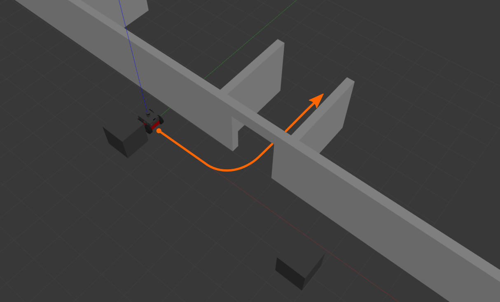

# Preparations for the Robotics Summer School

In order to be prepared for the Robotics Summer School, please follow the steps below:

1. **Set up the simulation environment on your computer** 
Follow the steps outlined in [the installation guide](../installation/) to setup the SMB software stack and the simulation environment.

2. **Get familiar with the simulation environment** 
Use the [Mission Planner](../simulation/tasks/mission-planning.md) to create a simple twist mission that drives the robot through the small passage in the default simulation environment (`WaA.world`). Use [this Google form](https://forms.gle/StKLWEq9gztQDs758) to share your results with us.
{: width="600px"}

3. **Prepare for the tutorials** 
Please go through all [tutorial preparations](tutorial_preparations) steps.

{: .important}
Please make sure to download all required **rosbags** and **docker images** for the tutorials before the start of the Robotics Summer School as the internet connection might be slow during the event.

