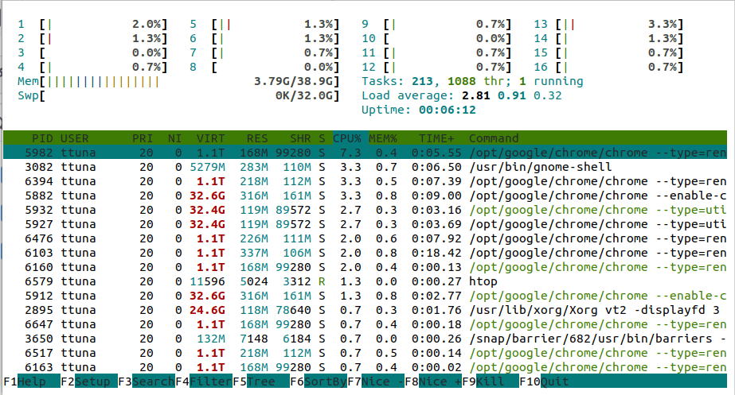
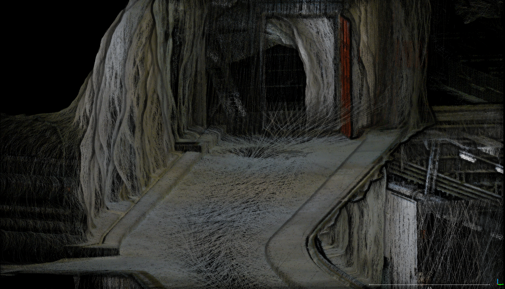
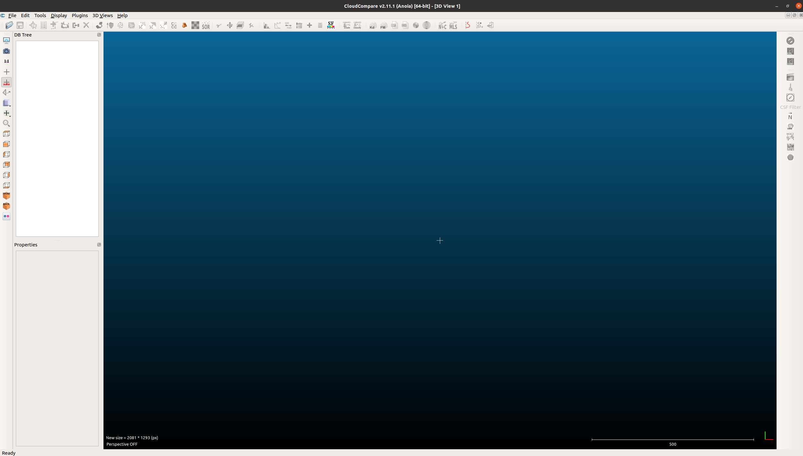

# 🧭 Preparations for SLAM Tutorial

This section highlights the steps to follow to prepare for the SLAM tutorial during the Robotics Summer School 2024.

The official documentation can be found in the [open3d_slam_advanced_rss_2024_public](https://github.com/ETHZ-RobotX/open3d_slam_advanced_rss_2024_public) repo and the [smb_slam](https://github.com/ETHZ-RobotX/smb_common/tree/master/smb_slam) page.

## 🔧 Setting-up

The tutorial material can be run if you have successfully followed the [installation steps](../../installation/index.md). Using [RSS Workspace](../../installation/rss-workspace.md) is recommended.

```bash
# build smb_slam
catkin build -c smb_msf_graph smb_slam
```
You have installed the important bits everything correctly if building ```smb_slam``` doesn't throw any error.

### 🔧 Installing htop
To inspect computational cost of operations, lets intall the htop tool.
```bash
# Install htop
sudo apt install htop
```
The tool can be initialized with the command `htop`, make sure to sort the operations by CPU usage via clickling to the CPU tab. 



The CPU tab indicates the amount of threads a process allocates in terms of percentage. 100% can mean allocation of 1 thread for 100% or 2 threads of 50% but regardless equivalent compute power. If power of each thread drops (i.e. maybe you unplugged your laptop) the percentage might increase to compansate.


### 🔧 (Very optional but if you are a fellow SLAM enthusiast, you might enjoy this) Installing CloudCompare 
CloudCompare is a tool to visualize and manipulate point clouds and 3D data in general. As it is a 3rd party tool, it is not extremely stable. However, for quick operations it is very useful. First we need to ensure we have the right tool to install CloudCompare:

```bash
# Install snap
sudo apt install snapd
```
after installing snap, we can have access to the version of CloudCompare in snap. Install this version via:

```bash
# Install cloudcompare
sudo snap install cloudcompare
```
this operation may download some data, I suggest to to try it **before** the tutorial. If you can't totally fine as this is optional. If you successfully installed CloudCompare you should be able to find it via the search:



Check if everything is right by openning the regular CloudCompare (not the viewer). You should something like this:



now you scan drag and drop `.pcd`, `.ply`, `.e57` and many more formats and inspect the maps.


## 📂 Resources
The tutorial will show you how to run the system and how to judge it's performance. As it is interactive, you don't need to read papers about it. But if you are curious take a [look](https://www.research-collection.ethz.ch/bitstream/handle/20.500.11850/551852/ICRAposterandabstract.pdf?sequence=1&isAllowed=y).

### 🔍 Open3D SLAM Resources

To refer information about `open3d_slam` repo can be found here:
- [Repo](https://github.com/ETHZ-RobotX/open3d_slam_advanced_rss_2024_public)
- [Docs](https://open3d-slam.readthedocs.io/en/latest/)
- [Usage](https://github.com/ETHZ-RobotX/smb_common/tree/master/smb_slam)
- [Open3D Library Docs](https://www.open3d.org/docs/release/introduction.html)

You can inspect the original Open3D library if you want to write additions to the Open3D SLAM implementation. We are using the C++ API so feel free to directly check the implementations in the source code and unit tests [here](https://github.com/isl-org/Open3D/tree/main/cpp/tests).

### 🗃️ ROSBag

In order to follow the tutorial, you will need the following rosbag:

- <a href="http://robotics.ethz.ch/~asl-datasets/2023_RoboticsSummerSchool_testing_data/2023-06-16-11-33-01_smb263.bag" download>Tutorial rosbag</a>

Furthermore, we need to put this rosbag as `/open3d_slam_advanced_rss_2024_public/open3d_slam_rsl/ros/open3d_slam_ros/data/tutorial.bag`. If you installed everything correctly you can locate the this directory with:

```bash
roscd open3d_slam_ros && cd data
```

#### Using RSS Workspace/ SMB Docker?

If you have downloaded the ROS bag files to your local machine and are using Mac or Windows, you can copy them into the Docker container using the docker cp command. Ensure the Docker container is running before performing these steps:

1. Find the name of the Docker container by running the following command (make sure your Docker container is running)

   ```bash
   docker ps
   ```

   The output will look like this if you are using the rss_workspace:
   ```
   CONTAINER ID   IMAGE                            COMMAND       CREATED         STATUS         NAMES
   1234567890ab   vsc-rss_workspace-123asd-uid     "/bin/bash"   5 minutes ago   Up 5 minutes   sad_hawking
   ```
   
   or like this if you are using the smb_docker:
   ```
   CONTAINER ID   IMAGE             COMMAND       CREATED         STATUS         NAMES
   1234567890ab   smb_docker        "/bin/bash"   5 minutes ago   Up 5 minutes   sad_hawking
   ```

   In this example, the name of the Docker container is `sad_hawking`.

2. Copy the ROS bag file into the Docker container, replacing `<NAME-OF-CONTAINER>` with the actual name of the Docker container and `/path/to/your/tutorial.bag` with the path to the ROS bag file on your local machine:

   ```bash
   # copy the bag file from local storage to the docker container
   docker cp /path/to/your/tutorial.bag <NAME-OF-CONTAINER>:/workspaces/rss_workspace/src/slam/open3d_slam/open3d_slam_rsl/ros/open3d_slam_ros/data/
   ```

   {: .note}
   If you are using vscode, you can try to drag and drop the rosbag into the vscode file explorer to copy it into the container. But be aware that this might take longer than `docker cp`. For example, it might take a few minutes to copy a 1GB file.

and inspect the absolute path with `pwd` bash command.

### 📋 Tutorial Material

The SLAM tutorial is going to be mostly interactive and a walkthrough on importance if different aspects of the system. There is going to be 3 sub-problems we will tackle and including 
- 1-) LiDAR Only Odometry and SLAM
- 2-) External Odometry based LiDAR-SLAM
- 3-) Closed Loop SE and SLAM.
- Bonus: Sequential bag replay and generated map visualization.

#### 📋 Tutorial-1 :-1:
Think about what might go wrong in LiDAR Only case. Why would we like to give an external prior? What happens when there are limited objects in the environment? What do we expect in terms of computation?

> **Think**:  Why would we like to give an external prior? What happens when there are limited objects in the environment? What do we expect in terms of computation?

#### 📋 Tutorial-2 :neutral_face:
Now we provided an external odometry from the T265 Intel Tracking camera (Visual-inertial Odometry).

> **Think**: Does providing an external prior help? What do we observe in terms of smoothness? What about computation? Did we just become dependent on this odometry? Why dont we use other sources of odometry? Don't we need to know where this odometry is coming from?

#### 📋 Tutorial-3 :sunglasses:
We are now in a closed-loop system! There is feedback in this system , GMSF <---> O3D. The sensor fusion is done by `smb_msf_graph` and O3D provides the good LiDAR mapping poses. :chart_with_upwards_trend:

> **Think**: What happens if one of the modules suffer? How does computation look like this time?

The tutorial launch files are located in `/smb_common/smb_slam/launch/` directory. Which can be found by `roscd smb_slam && cd launch`. The tutorial files can also be adapted for RSS usage as they show common workflows.

The link for the tutorial slides will be available soon [here]().

<!-- 
The link for the tutorial scripts will be available soon [here](). -->


<!-- ### Download tutorial scripts and data

Download the following [folder](https://drive.google.com/drive/folders/1UYSW2WWhQVyTyuiPeuYasUF1EvQcqu1R?usp=sharing) which contains the tutorial scripts and maps. -->


<!-- ## Manual Installation (Optional)

### Open3d Python install

You need to install the open3d python API which will be needed for tutorial on scan registration. We will use conda for this.

1. Install anaconda:  
    a. You can follow the instructions [here](https://linuxize.com/post/how-to-install-anaconda-on-ubuntu-20-04/)  
    b. Type ```yes``` to the following prompt(```Do you wish the installer to initialize Anaconda3 by running conda init?```)  
    c. Run the following command so that conda base is not automatically activated in every new terminal:  
         ```conda config --set auto_activate_base false``` 

2. Create a new conda environment:   
    ```
    conda create -n open3d_env python=3.8
    ```

3. Activate the conda environment:  
    ```
    conda activate open3d_env
    ```
4. Install open3d in the activated conda environment.
    ```
    pip install open3d==0.16.0
    ```

#### Verify the installation  

Check the open3d version (it should be 0.16)

1. In a terminal activate the conda environment and open python console:
    ```bash
    conda activate open3d_env
    python
    ```
2. Import open3d and check the version:
    ```
    import open3d
    open3d.__version__
    ```

### Open3d_slam install (cpp package, required for online SLAM and Localization)

Make sure that you have installed the repositories following the instructions [here](https://ethz-robotx.github.io/SuperMegaBot/core-software/installation_core.html
) for core SMB software since we will be running online SLAM in Gazebo simulation.  

Some additional dependencies are required for Open3d_slam for which you can follow these steps:

```bash
sudo apt install libgoogle-glog-dev
sudo apt install libglfw3 libglfw3-dev
sudo apt install ros-noetic-jsk-rviz-plugins
sudo apt install liblua5.2-dev
sudo add-apt-repository ppa:roehling/open3d
sudo apt update
sudo apt install libopen3d-dev
```

You can now go to your rss workspace and directly build the package smb_gazebo and smb_slam by running the following command:

```bash
cd smb_ws # PATH TO YOUR WORKSPACE
catkin build smb_gazebo smb_slam
``` -->
