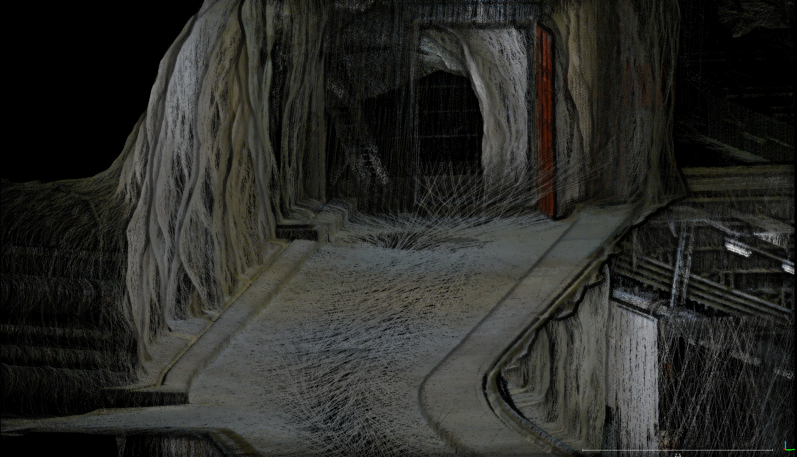

# 🧭 SLAM Tutorial

Welcome to the SLAM tutorial. This tutorial expects the reader to have already followed the preparations ([Preparation Instructions](../tutorial_preparations/slam_tutorial_preparations.md)) and compiled the required modules, i.e., `smb_slam` and `smb_msf_graph`.

The tutorial will consist of **3 interactive examples**. First, background information will be provided on the tutorial parts, and then we will observe the system behavior. We will analyze the performance, robustness, and computational requirements of the system given a dataset.

Link to the [Slides](https://docs.google.com/presentation/d/1GL9zNxByaHGRzI-YQ3DODKc2xlg69W0kwwL4BB0Y5S8/edit?usp=sharing).



---

## 0 - Introduction to Open3D SLAM and the Tools (Instructor)
[Open3D SLAM](https://github.com/ETHZ-RobotX/open3d_slam_advanced_rss_2024_public) is a LiDAR-based SLAM system capable of localization and mapping. It is mainly responsible for keeping a consistent world representation and the pose of the robot within this representation (map). 

- As a tool, Open3D SLAM can operate solely on point clouds. We call this LiDAR Odometry / LiDAR Only SLAM. Also, Open3D SLAM is capable of listening to external odometry estimates (example: `smb_msf_graph`) as a means of initial guess.
- It can provide tools such as map generation and saving, providing a post-processed pose bag and path of the robot in the world.

### 0.1 - Open3D SLAM Software Architecture (Instructor)
Let's quickly touch on the software architecture of the system and discuss what we are going to change.

### 0.2 - Open3D SLAM Visualization Summary (Instructor)
Let's walkthrough the RVIZ visualization we have and what options it provides. Furthermore, additional visualizations for tutorials will be presented.


---

## 1.0 - Tutorial 1: LiDAR Only Odometry and SLAM (Mostly Interactive)
In this tutorial, we will run Open3D SLAM in LiDAR-only mode and run alongside a mission bag. We will inspect the results and the generated point cloud map.  

### 1.1 - Minor Recap: LiDAR Only Operations with Open3D SLAM (Instructor)
A minor recap by the instructor on what we are doing.


### 1.2 - Running the Tutorial

To start, run the following launch file on your computer and make 3 windows pop-up: one RVIZ window and 2 terminal windows. At any time, feel free to terminate the run with `Ctrl+C` and restart to re-observe!

```bash
# In a terminal
roslaunch smb_slam tutorial_1.launch
```

After inspecting the RVIZ window and the motion of the robot:
> **Discussion**:  Do you think the localization is smooth and the map is accurate?
> 
> - What do you think happened?
> - How does the robot path and best guess trajectories look?
> - Did you take a look at `htop` or the `Rostopic` terminal?

## 2.0 - Tutorial 2: LiDAR-SLAM with External Odometry (Mostly Interactive)
In this tutorial, we will run Open3D SLAM in regular SLAM mode, and instead of Scan2Scan LiDAR Odometry, we will use external odometry from the T265 Tracking camera contained in the rosbag.

### 2.1 - Minor Recap: How to Integrate External Odometry? (Instructor)
A minor recap by the instructor on what we are doing.


### 2.2 - Running the Tutorial

To start, run the following launch file on your computer and make 3 windows pop-up: one RVIZ window and 2 terminal windows. At any time, feel free to terminate the run with `Ctrl+C` and restart to re-observe!

```bash
# In a terminal
roslaunch smb_slam tutorial_2.launch
```

After inspecting the RVIZ window and the motion of the robot:
> **Discussion**:  Compared to the LiDAR Only case, did it go right?
> 
> - Why is there a gap between two trajectories?
> - How do the robot path and best guess trajectories look?
> - Did you take a look at `htop` or the `Rostopic` terminal?

## 3.0 - Tutorial 3: LiDAR-SLAM and SE in a Closed-Loop (Mostly Interactive)
In this tutorial, we will run Open3D SLAM in regular SLAM mode, and instead of Scan2Scan LiDAR Odometry, we will use external odometry from the T265 Tracking camera contained in the rosbag.

### 3.1 - Minor Recap: How to Make a Closed-Loop SLAM-SE System Work? (Instructor)
A minor recap by the instructor on what we are doing.


### 3.2 - Running the Tutorial

To start, run the following launch file on your computer and make 3 windows pop-up: one RVIZ window and 2 terminal windows. At any time, feel free to terminate the run with `Ctrl+C` and restart to re-observe!

> **Note**: For this tutorial, we check a new RVIZ view from the perspective of `smb_msf_graph`. To have a second RVIZ view from the `smb_slam` perspective, set ` <arg name="launch_rviz" default="true"/> ` in the launch file of this tutorial.

```bash
# In a terminal
roslaunch smb_slam tutorial_3.launch
```


After inspecting the RVIZ window and the motion of the robot:
> **Discussion**:  Compared to Tutorial 2, is the computation better?
> 
> - What can go wrong in such a coupled system?
> - Did you take a look at `htop` or the `Rostopic` terminal?

## 4.0 - (Bonus + Optional): Let's Visualize the Generated Map and Replay a Bag Sequentially
During the week, you will realize that running missions on the robot is only one part of the action. Often, you will need to develop given data and visualize your results! Some of the tools shown in this bonus can aid you in achieving this.

### 4.1 - Offline Visualization of a Map

This part expects you to have a map in the directory `$(find smb_slam)/data/maps/map.pcd`. An RVIZ window will pop up and the map will become visible shortly. This example can easily be extended to do post-processing on maps, such as noise reduction using Open3D functionality.

```bash
# In a terminal
roslaunch smb_slam visualize_map.launch
```

### 4.2 - Sequential Replaying of a Bag with Odometry in It

This example illustrates how to run a bag sequentially with Open3D, meaning the node will not skip any measurements and is guaranteed to process all the measurements. However, in compute-limited systems, it might be slower than real-time, while in strong computers, faster than real-time. For details of the launch file, check `/open3d_slam_rsl/ros/open3d_slam_ros/launch/tutorials/bonus_replay.launch` configuration. An RVIZ window will pop up and the robot should start moving while accumulating the registered points. The accumulation can become heavy as time passes, so be observant and, if necessary, un-toggle the registeredPointCloud option in RVIZ.

```bash
# In a terminal
roslaunch smb_slam replay_SLAM.launch
```
