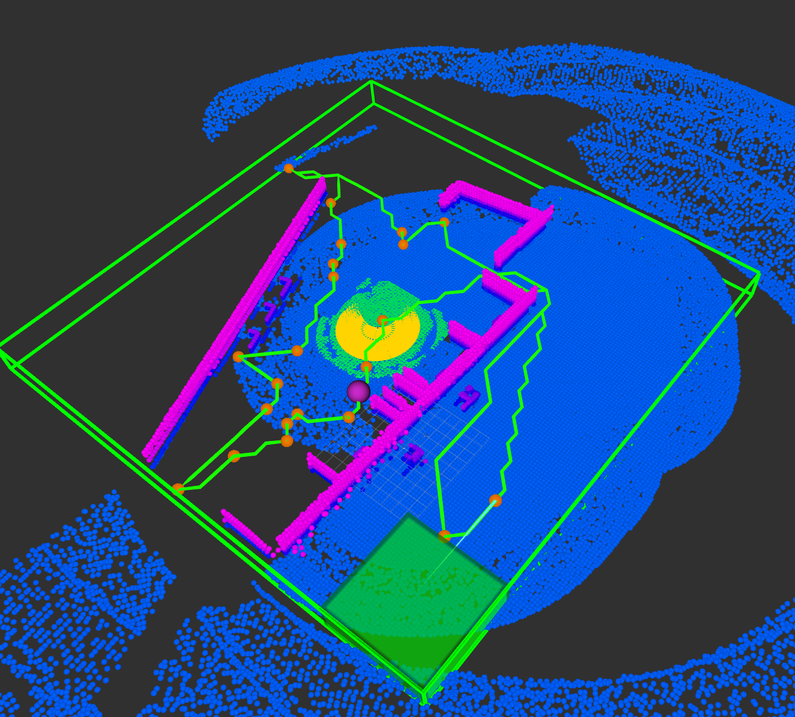

# 🗺️ Exploration

{: .no_toc}

* Table of contents
{:toc}

Make sure that the `smb_exploration` is built. If not, run:

```bash
# In the host PC
catkin build smb_exploration
```

## 🧭 Lower Level Planner

Launch the default simulation environment:

```bash
# In the host PC
roslaunch smb_gazebo sim.launch
```

Launch the slam:
```bash
# In the host PC
roslaunch smb_msf_graph smb_msf_graph.launch use_sim_time:=true
```

Launch the local planner and path follower:
```bash
# In the host PC
roslaunch smb_navigation navigate2d_cmu.launch use_msf:=true global_frame:=world_graph_msf state_estimation_topic:=/transformed_odom launch_far_planner:=false
```

At this stage you should be able to set the local way points for SMB to follow as described in Navigation section.

## 🗺️ Exploration with TARE Planner

Launch [TARE Planner](http://www.hongbiaoz.com/files/paper5.pdf) for exploration:
```bash
# In the host PC
roslaunch smb_exploration smb_rss_tare.launch rviz:=false
```
<a href="../../images/tare_explore.png" target="_blank"></a>
Now you should see SMB following the green global exploration path.