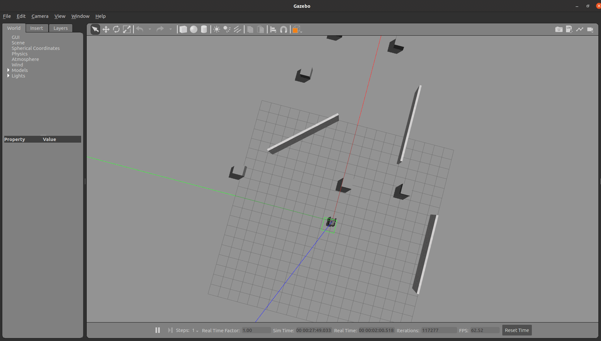
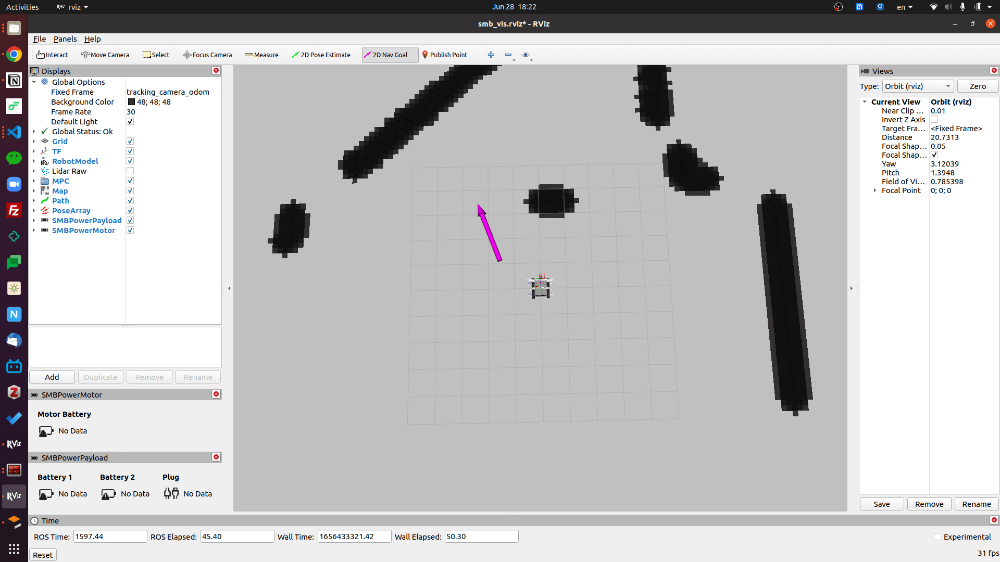

# 🧭 Autonomous Navigation
{: .no_toc}

* Table of contents
{:toc}

More information about the path planner can be found in the [path planner repository](https://github.com/ETHZ-RobotX/smb_path_planner).

Since we have successfully set up the SMB software, one can launch the simulation and get the first experience with the autonoumous point goal navigation.
Make sure that the `smb_navigation` is built. If not, run:

```bash
# In the host PC
catkin build smb_path_planner
```

## ⚡ Quick Test

Launch the simulation environment in `planner_tutorial.world`:

```bash
# In the host PC
roslaunch smb_gazebo sim.launch tracking_camera:=true launch_gazebo_gui:=true world:=planner_tutorial
```

In another terminal, launch the localization and mapping:
```bash
# In the host PC
roslaunch smb_msf_graph smb_msf_graph.launch use_sim_time:=true
```

## Local Planner
In the third terminal, launch the local path planner:
```bash
# In the host PC
roslaunch smb_navigation navigate2d_cmu.launch use_msf:=true global_frame:=world_graph_msf state_estimation_topic:=/transformed_odom launch_far_planner:=false
```

Now you can set the waypoint for the robot to navigate to using the Waypoint plugin in rviz.\\
Note: Be sure to set the fixed frame in rviz to world_graph_msf. You can find this under the global options on the top left.
<a href="../../images/waypointplugin.png" target="_blank"></a>

Select the plugin, then click on a desired position to set it as the waypoint.
Now the robot should navigate to the waypoint while avoiding the obstacles autonomously.
<a href="../../images/local planner.png" target="_blank"></a>

## Point Goal Navigation with FAR Planner
While the local planner is mainly there for reaching a close way point and avoiding obstacles, it is not designed for directly navigating to a long distance goal. Now you will use a state-of-the-art planner, [FAR planner](https://arxiv.org/pdf/2110.09460), to achieve longer distance navigation.
Launch the local planner with FAR planner, simply set the launch_far_planner argument to true:
```bash
# In the host PC
roslaunch smb_navigation navigate2d_cmu.launch use_msf:=true global_frame:=world_graph_msf state_estimation_topic:=/transformed_odom launch_far_planner:=true
# or simply
roslaunch smb_navigation navigate2d_cmu.launch use_msf:=true global_frame:=world_graph_msf state_estimation_topic:=/transformed_odom #launch_far_planner is true by default
```
Now you can set the goalpoint using the Goalpoint plugin in rviz.
<a href="../../images/goalpointplugin.png" target="_blank"></a>

Just like setting the waypoint, select the plugin, then click on a desired position to set it as the goal point.
Now the robot should navigate to the goal point while avoiding the obstacles autonomously.
<a href="../../images/far planner.png" target="_blank"></a>


<!-- ## Other Navigation Methods

Subsequently, in a second terminal window, launch the OMPL path planner:

```bash
# In the host PC
roslaunch smb_navigation navigate2d_ompl.launch sim:=true global_frame:=tracking_camera_odom
```

In RViz, you should see a red-colored map with SMB in the middle. Switch the fixed frame to `tracking_camera_odom`. Now, select `2D Navigation Goal` from the top toolbar and set the goal for the planner in the feasible region within the map.

| Gazebo | RVIZ |
| ------------------ | ------------------ |
| <a href="../../images/gazebo_viz.png" target="_blank"></a> | <a href="../../images/rviz_viz.png" target="_blank"></a> |

> PS: Click the image to see in full size.

To be able to use the advanced features of the path planner, refer to the [SMB path planner Wiki](https://github.com/ETHZ-RobotX/smb_path_planner/wiki).
{: .note } -->

## 📋 Other Navigation Methods

An overview of different options to start the autonomous navigation is given below. For a more detailed explanation, please refer to [legacy path planner](https://github.com/ETHZ-RobotX/smb_path_planner) and [SLAM](https://github.com/ETHZ-RobotX/smb_common/blob/exploration/smb_slam/README.md).

### 1️⃣ Running with Tracking Camera

Launch the Gazebo + RViz:

```bash
# in the first terminal 
# source the workspace (wssetup in rss workspace)
roslaunch smb_gazebo sim.launch tracking_camera:=true launch_gazebo_gui:=true world:=planner_tutorial
```

Launch OMPL planner:

```bash
# In the second terminal 
# source the workspace (wssetup in rss workspace)
roslaunch smb_navigation navigate2d_ompl.launch sim:=true global_frame:=tracking_camera_odom

# If you see the message "odom received",
# everything started without any problem
```


### 2️⃣ Running with Online SLAM + MSF Graph

Launch the Gazebo + RViz:

```bash
# in the first terminal
# source the workspace (wssetup in rss workspace)
roslaunch smb_gazebo sim.launch launch_gazebo_gui:=true world:=planner_tutorial
```

Launch MSF Graph + Open3D SLAM:

```bash
# in the second terminal - launch the state estimator with online SLAM
# source the workspace (wssetup in rss workspace)
roslaunch smb_msf_graph smb_msf_graph.launch use_sim_time:=true
```

Switch the fixed frame to `map_o3d`. 

Launch OMPL planner:

```bash
# in the third terminal - launch the autonomous navigation
# source the workspace (wssetup in rss workspace)
roslaunch smb_navigation navigate2d_ompl.launch sim:=true global_frame:=world_graph_msf odom_topic:=/graph_msf/est_odometry_odom_imu

# If you see the message "odom received",
# everything started without any problem
```


To save the map, use the following ROS service:

```bash
# source the workspace (wssetup in rss workspace)
rosservice call /mapping/save_map
```

The point cloud will be saved to `src/core/smb_slam/data/maps/map.pcd`.


### 3️⃣ Running with Localization SLAM + MSF Graph

If an existing global map is available, it can be used for planning.

Launch the Gazebo + RViz:

```bash
# in the first terminal
# source the workspace (wssetup in rss workspace)
roslaunch smb_gazebo sim.launch launch_gazebo_gui:=true world:=planner_tutorial
```

In the next step, the state estimator needs to be launched:

```bash
# in the second terminal - launch the state estimator with online SLAM
# source the workspace (wssetup in rss workspace)
# this will automatically fetch the map saved in smb_slam/data/maps/map.pcd which can be configured in param_rs16_localization.lua
roslaunch smb_slam localization.launch use_sim_time:=true
```

Make the fixed frame `map_o3d`. Before running anything else, you need to first localize the robot in the map. This can be done in Rviz using `2D Pose Estimate` from the top toolbar. The localization is successful if the data from the LiDAR and the points from the map align. Once this is done, you can run the state estimation and autonomous planning as follows:

```bash
# in the third terminal - launch the state estimator
# source the workspace (wssetup in rss workspace)
roslaunch smb_msf_graph smb_msf_graph.launch launch_o3d_slam:=false use_sim_time:=true
```

```bash
# in the fourth terminal - launch the autonomous navigation
# source the workspace (wssetup in rss workspace)
roslaunch smb_navigation navigate2d_ompl.launch sim:=true global_frame:=world_graph_msf odom_topic:=/graph_msf/est_odometry_odom_imu

# If you see the message "odom received",
# everything started without any problem
```

Once the autonomous navigation is running, you can use the Rviz `2D Navigation Goal` tool. 
