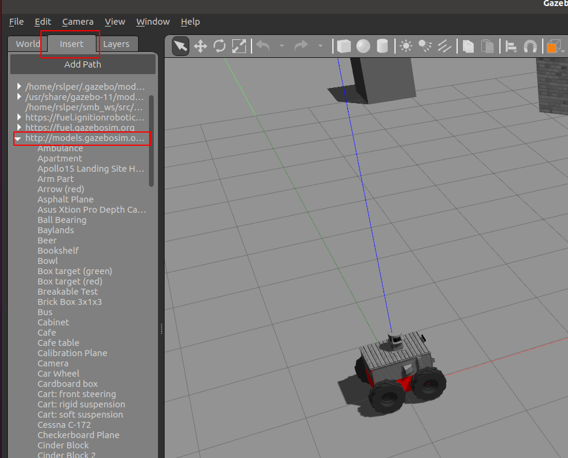
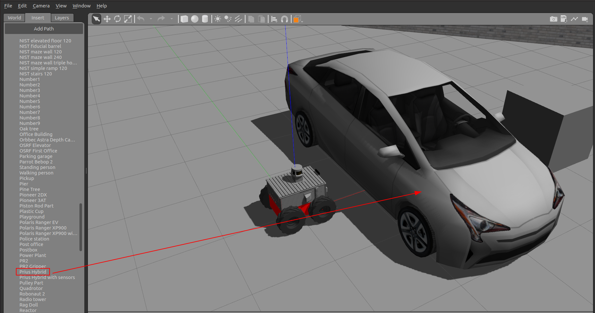
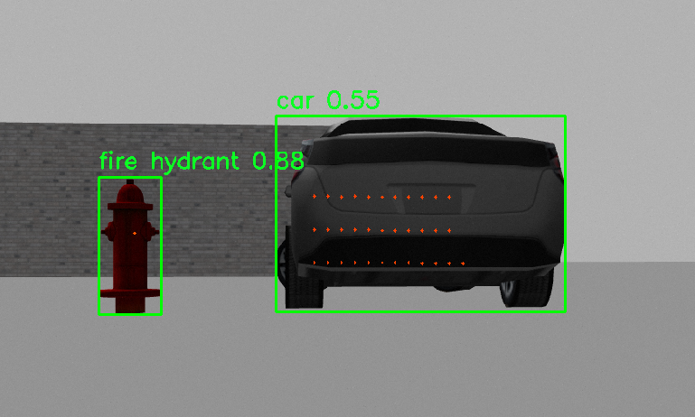

# 🕵️‍♂️ Object Detection in Simulation

Once the planner is set up and the SMB simulation is running, you can begin experimenting with object detection. Ensure that the `object_detection` package is built. If it isn't, use the following command:

```bash
# On the host PC
catkin build object_detection   
```

Next, launch the object detection locally with these parameters for simulation:

- `gpu="off"`: Runs detection on the CPU.
- `model_path=""`: Don't set this parameter if you want to use the pre-installed model. If you have a downloaded model, specify its path.
- `model="yolov5l6"`: Selects the pre-installed YOLOv5 model.
- `object_detection_classes="[0,1,2,10]"`: Populate this list with the IDs of objects added to the Gazebo scene. If you leave this empty, it will try to detect all the objects. To see what numbers correspond to what items, check out the [Artefact Detection Tutorial](../..//rss/preparations/artefact_detection_tutorial_preparations.md) page and look for the **YOLOv5 Supported Object Classes** section. `[0, 1, 2, 10]` correspond to person, bicycle, car, and fire hydrant.

To launch the detection pipeline locally, run:

```bash
# In the host PC
roslaunch object_detection object_detection.launch gpu:=off model:=yolov5l6 object_detection_classes="[0,1,2,10]"
```

For more information, please check out the [Artefact Detection Tutorial](../../rss/preparations/artefact_detection_tutorial_preparations.md).

## 🛠️ Adding Artifacts in Gazebo

If you want to add artifacts in Gazebo, you can do so easily by following these steps:

1. Open Gazebo and launch your simulation environment.
2. Click on the "Insert" tab located on the left side of the Gazebo interface.

   

3. Browse through the list of available objects and models.
4. Select the desired object (e.g., cars, boats, etc.) and click to insert it into your simulation environment. In this example, we selected a prius!

   

5. Position the object as needed within the simulation, and start the object detector to see the magic!

   

This will allow you to customize your simulation environment by adding various objects for more comprehensive testing and development. Make sure the object you are trying to detect is part of the dataset that YOLOv5 supports!

---
